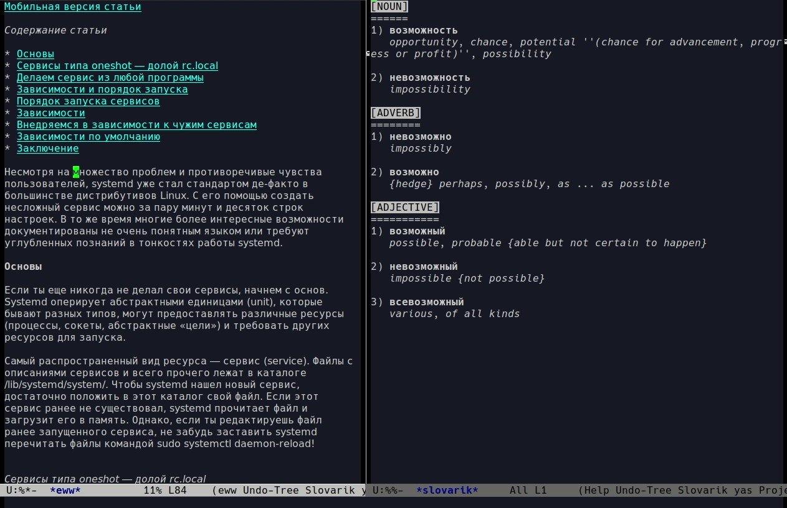

# slovarik-mode
Slovarik is a small Russian-English dictionary and minor mode meant for looking up and learning words within Emacs.
It is based on the Wiktionary project and uses simple rules for searching word.

To use it, include `slovarik.el` into a path which Emacs can find.

## Installation

Slovarik can be installed by either just `slovarik.el` or placing the contents of the `src/` directory into a path which Emacs can find.

For example, to install `slovarik.el`, you may run this one-liner:

`$(cd ~/.emacs.d; git clone https://github.com/kirthivaasan/slovarik.git; echo -e "\n;; loading slovarik-mode\n(add-to-list 'load-path \"~/.emacs.d/slovarik/\")\n(load \"slovarik\")" >> init.el)`

## Usage

Enable the mode by running:

`M-x slovarik-mode`

### Basic lookup

Point your text cursor and `C-c C-v` (`slovarik-auto-lookup`) to look up a word.

You may manually search for words/phrases that contain dashes and spaces with `M-x slovarik-user-lookup <RET> <your query>`.

### User wordlists

* `C-c C-i` (`slovarik-insert-word`) adds a word (either a noun, a verb or an adjective) to the corresponding user wordlist, stored in `/src/user/`.

* `C-c C-r C-u` (`slovarik-reset-user-env`)  resets the user environment, flushing all user wordlists in `/src/user/`. 

> Warning: bear in mind that for a complete env reset, emacs will need to be restarted.
