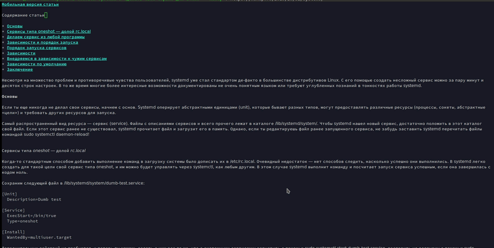

# slovarik
Slovarik is a small russian dictionary and minor mode meant for looking up words within Emacs.
It is based on the Wiktionary project and uses simple rules for searching words.

To use it, include `slovarik.el` into a path which Emacs can find.

## Installation

Installing slovarik is very quick and easy, just run this one-liner command:

`$(EMACS=~/.emacs.d; mkdir -p $EMACS/slovarik; cd $EMACS/slovarik; wget https://raw.githubusercontent.com/kirthivaasan/slovarik/master/slovarik.el; cd ..; echo -e "(add-to-list 'load-path \"~/.emacs.d/slovarik/\")\n(load \"slovarik\")" >> init.el;)`

## Usage

Enable the mode by running:

`M-x slovarik-mode`

Point your text cursor and `C-c C-v` to look up a word.

